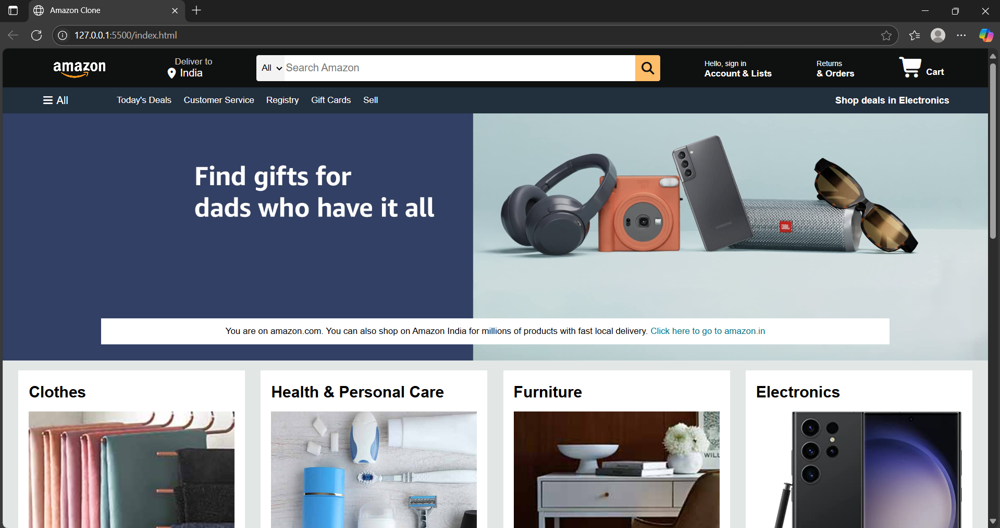

# 🛒 Amazon.com Clone

A modern, static web page replicating the homepage of **Amazon.com**. This project is built entirely with **HTML** and **CSS**, showcasing a clean, responsive layout and a user interface similar to the original website.



---

## 🚀 Features

- **Responsive Navigation Bar**  
  A multi-part header including a logo, location icon, functional search bar with category dropdown, and links for sign-in and cart.

- **Dynamic Hero Section**  
  A large hero image with an overlay message linking to the Amazon India website.

- **Product Grid Layout**  
  The shop section uses a responsive grid to display various product categories such as _Clothes_, _Electronics_, _Beauty Picks_, and _Pet Care_. Layout is managed using **CSS Flexbox** and wrapping.

- **Detailed Footer**  
  A multi-column footer with links for customer service, payment products, and company information.

- **Icon Integration**  
  Icons from **Font Awesome** are used for location, search, and shopping cart elements.

---

## 🛠️ Technologies Used

**Frontend**  
- HTML5  
- CSS3  

**Icons**  
- Font Awesome

---

## 🚀 Getting Started

This is a **static website**, so no backend or build process is required.

---

### 🔧 Installation

1. Clone the repository:

```bash
   git clone https://github.com/your-username/amazon-clone.git
   cd amazon-clone
````

2. Open the project in your preferred code editor.

---

### ▶️ Running the Application

Simply open the `index.html` file in any modern web browser to view the project.

---

## 🤝 Contributing

We welcome contributions! If you have suggestions for new features or improvements, feel free to submit a pull request.

1. Fork the project

2. Create your feature branch:

   ```bash
   git checkout -b feature/new-feature
   ```

3. Commit your changes:

   ```bash
   git commit -m 'Add a new feature'
   ```

4. Push to the branch:

   ```bash
   git push origin feature/new-feature
   ```

5. Open a Pull Request

---

## 🙏 Acknowledgments

* Design inspired by the original [Amazon.com](https://www.amazon.com) homepage.

